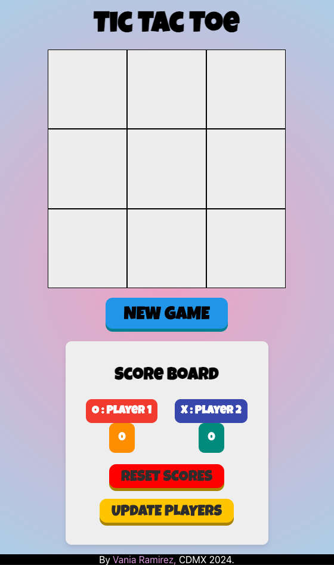

# TicTacToe Game

A simple TicTacToe Game built with Typescript and ReactJS.

- Allow two players to register their name and edit
- Allow the users to reset a game to start a new fresh game before having a winner to do not spoil the scores
- Each win is accumulated per session
- The scores can be reset anytime

